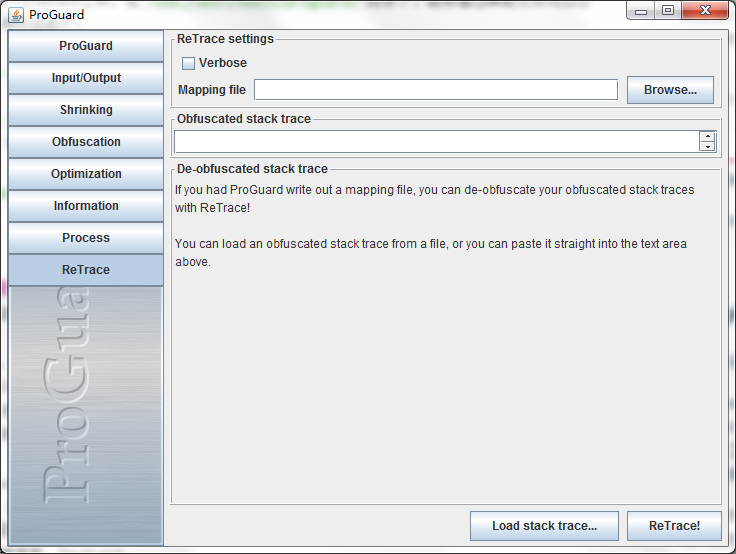

#ProGuard笔记
*2015-06-10 11:31*<br/>``Android``

---
[TOC]

ProGuard工具通过去除无用代码，重命名变量、方法、类等，能够收缩、优化、并且混淆代码。生成一个更小的apk包，同时增加逆向工程的难度。ProGuard只会在构建Release版本时才会起作用。

## 在AS中开启ProGuard
在`build.gradle`中添加如下代码即可开启ProGuard
```groovy
android {
    ...
    buildTypes {
        release {
            minifyEnabled true 
            proguardFiles getDefaultProguardFile('proguard-android.txt'),
            'proguard-rules.pro'
        }
    }
}
```
**注**：`getDefaultProguardFile('proguard-android.txt')`表示在`<sdk>/tools/proguard/`下的`proguard-android.txt`默认配置文件，之后的为自定义的配置文件

## 配置ProGuard
在一般情况下，默认的ProGuard配置已经够用了，但是有时候ProGuard会移除一些它认为没用的东西，导致项目的错误，比如说：
- 只在`AndroidManifest`文件中出现的类
- 在JNI中调用的方法
- 动态引用的类或者方法

由于混淆后导致类或方法无法找到，通常表现为出现`ClassNotFoundException`、`MethodNotFoundException`，解决方法是配置自定义ProGuard文件的`keep`选项
```
-keep public class <MyClass>
```
当然可不只`keep`选项这么简单，[ProGuard Manual](http://stuff.mit.edu/afs/sipb/project/android/sdk/android-sdk-linux/tools/proguard/docs/index.html#manual/introduction.html) 中详细介绍了ProGuard的用法。详细语法见附录。


##回溯混淆的日志
由于Release版本的混淆，在进行日志收集的时候堆栈信息将会混乱不堪，无法阅读，这时候，需要对手机的日志进行回溯。

Android SDK提供了一个`retrace`工具，在`<sdk_root>/tools/proguard/bin`目录下，能够通过映射文件对日志进行重新生成，使用方法如下：
```
retrace.bat|retrace.sh [-verbose] mapping.txt [<stacktrace_file>]
```
其中`mapping.txt`是在release版本编译时自动生成的，在`build/outs/`目录下。所以有必要在每次版本发布的时候保存该文件，用于日志的解析。

除此之外，在`<sdk>/tools/proguard/bin`目录下存在一个叫做`proguardgui`的GUI工具，通过图形界面可以方便地选择映射文件，完成回溯。



## ProGuard和DexGuard

Progurad是免费的，而且已经集成到Android ADT中了，使用起来很方便。但是，即使使用Pgoruard混淆了我们的apk文件，也可以使用apktool工具反编译出资源，能够看到Manifest文件，res资源等等。也可以使用dex2jar工具生成jar文件，进而使用jd工具反编译出Java代码片段。虽然，这些代码大部分都经过了混淆，已经很难阅读，但是还是可以读的。

更危险的是，Proguard只能保护代码，却不能保护我们的apk文件。任何人都可以使用apktool工具，反编译我们开发的apk文件，进而更改其中各种资源，或者更改部分代码，甚至是注入代码，然后再打包回apk，二次发布后，达到自己的目的。或者是加入了广告，或者是增加了恶意木马病毒，等等。
还好，我们还有一种选择，DexGuard。

DexGuard是收费的，虽然挺贵的，但是对于一个公司来说，还是可以承受的。DexGuard是在Proguard基础上，加入了更多的保护措施。使用DexGuard混淆后，生成的apk文件，就无法正常使用apktool反编译了。尽管还是能够反编译出部分资源文件，但是由于反编译过程不完全，就无法再打包成apk了。这样就保护了我们的apk文件，不会被二次打包发布了。

##附：ProGuard详细语法

具体参考 [Ref Card](https://stuff.mit.edu/afs/sipb/project/android/sdk/android-sdk-linux/tools/proguard/docs/index.html#manual/refcard.html)

#### 参数
```
-include {filename}    从给定的文件中读取配置参数 

-basedirectory {directoryname}    指定基础目录为以后相对的档案名称 

-injars {class_path}    指定要处理的应用程序jar,war,ear和目录 

-outjars {class_path}    指定处理完后要输出的jar,war,ear和目录的名称 

-libraryjars {classpath}    指定要处理的应用程序jar,war,ear和目录所需要的程序库文件 

-dontskipnonpubliclibraryclasses    指定不去忽略非公共的库类。 

-dontskipnonpubliclibraryclassmembers    指定不去忽略包可见的库类的成员。 
```

####保留选项 
```
-keep {Modifier} {class_specification}    保护指定的类文件和类的成员 

-keepclassmembers {modifier} {class_specification}    保护指定类的成员，如果此类受到保护他们会保护的更好 

-keepclasseswithmembers {class_specification}    保护指定的类和类的成员，但条件是所有指定的类和类成员是要存在。 

-keepnames {class_specification}    保护指定的类和类的成员的名称（如果他们不会压缩步骤中删除） 

-keepclassmembernames {class_specification}    保护指定的类的成员的名称（如果他们不会压缩步骤中删除） 

-keepclasseswithmembernames {class_specification}    保护指定的类和类的成员的名称，如果所有指定的类成员出席（在压缩步骤之后） 

-printseeds {filename}    列出类和类的成员-keep选项的清单，标准输出到给定的文件 
```
####压缩 
```
-dontshrink    不压缩输入的类文件 

-printusage {filename} 

-whyareyoukeeping {class_specification}     
```
####优化 
```
-dontoptimize    不优化输入的类文件 

-assumenosideeffects {class_specification}    优化时假设指定的方法，没有任何副作用 

-allowaccessmodification    优化时允许访问并修改有修饰符的类和类的成员 
```
####混淆 
```
-dontobfuscate    不混淆输入的类文件 

-printmapping {filename} 

-applymapping {filename}    重用映射增加混淆 

-obfuscationdictionary {filename}    使用给定文件中的关键字作为要混淆方法的名称 

-overloadaggressively    混淆时应用侵入式重载 

-useuniqueclassmembernames    确定统一的混淆类的成员名称来增加混淆 

-flattenpackagehierarchy {package_name}    重新包装所有重命名的包并放在给定的单一包中 

-repackageclass {package_name}    重新包装所有重命名的类文件中放在给定的单一包中 

-dontusemixedcaseclassnames    混淆时不会产生形形色色的类名 

-keepattributes {attribute_name,...}    保护给定的可选属性，例如LineNumberTable, LocalVariableTable, SourceFile, Deprecated, Synthetic, Signature, and InnerClasses. 

-renamesourcefileattribute {string}    设置源文件中给定的字符串常量 
```
---
*By [@yimu](https://github.com/yimun/Blog/blob/master/README.md)*