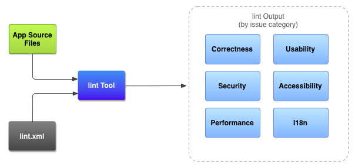
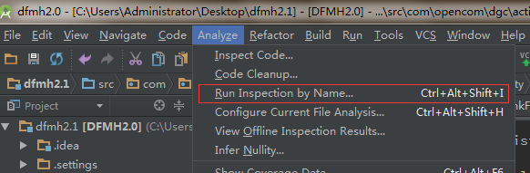
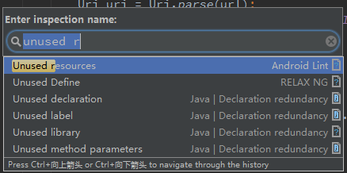
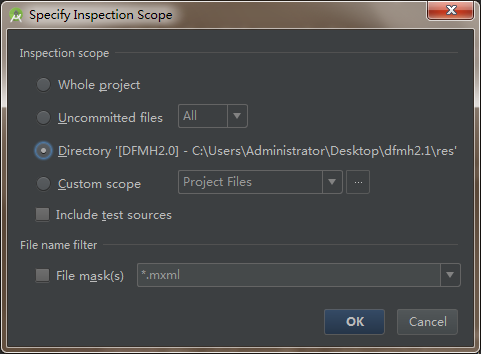
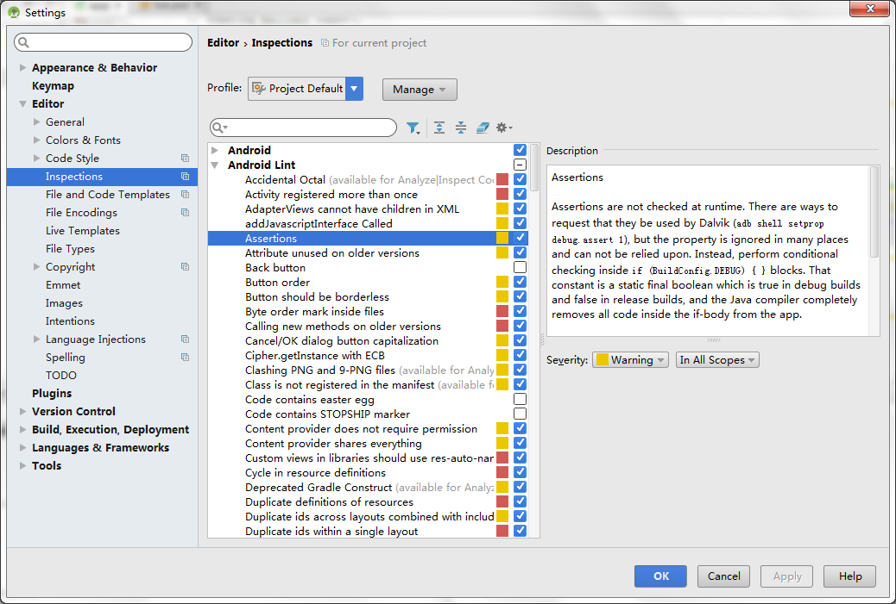
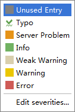
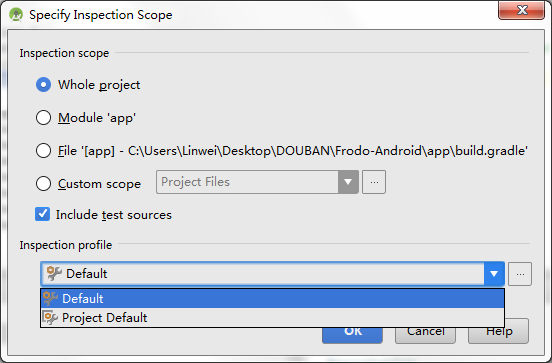

#Android lint的使用
*2015-06-10 11:39*<br/>``Android``

---
[TOC]

## 一、关于lint
除了测试你的应用是否满足了其功能需求外，保证代码没有结构化的错误也是非常重要的，不良构造的代码容易降低应用的可靠性和和效率，使代码变得越来越难以维护。

Android SDK提供了一个代码扫描工具`lint`, 来保证代码的结构质量，能够识别的代码问题有：
-  布局性能（以前是 layoutopt工具，可以解决无用布局、嵌套太多、布局太多）
- 未使用到资源
- 不一致的数组大小
- 国际化问题（硬编码）
- 图标的问题（重复的图标，错误的大小）
- 可用性问题（如不指定的文本字段的输入型）
- manifest文件的错误

这个工具不需要启动应用或者写测试样例，工具所检测出的代码错误都会以一个错误信息和安全等级的组合来描述，所以可以快速区分关键错误并修正它，当然我们也可以自定义安全等级来适应自己的项目。lint有自己的命令行工具，可以在自动化的测试脚本中添加使用。

**下图展示了lint的工作流程：**


## 二、使用lint
###在Android Studio上使用lint
在Android studio中，通过配置`build.gradle`文件可以在构建时实现`lint`代码监测，示例代码如下：
```groovy
android {
    lintOptions {
       // lint file
       lintConfig file("lint.xml")
       // set to true to turn off analysis progress reporting by lint
       quiet true
       // if true, stop the gradle build if errors are found
       abortOnError false
       // if true, only report errors
       ignoreWarnings true
     }
     ...
}
```
当然，你也可以手动执行lint分析，在AS中点击`Analyze > Inspect Code`，选择范围后即可手动执行

#### 例：使用lint找出系统中的无用资源

如上图：在项目中，点击菜单栏的Analyze -> Run Inspection by Name ...

弹出输入框： 


Enter 之后会弹出： 


**一般选择整个项目或某个模块，当然也可以指定某个目录，OK之后 Studio会自动分析，然后可以根据结果清除无用的资源文件。**

###在命令行中使用lint
这里只介绍使用gradlew工具进行lint检查
```
gradlew lintXxxx [--info]

```

##三、配置lint
通常当你运行lint时，lint会执行检查所有支持的检查项，但是有些检查对你的项目可能不是必须的，这时你可以手动对lint的检查选项进行配置。

###Android Studio可视化配置
在AS的`Settings->Editor->Inspections->Android lint`中可以对lint进行设置，

勾选需要检查的选项，并且可以设置安全等级，有如下几个等级供选择：

这些提示选项会在编辑器中以特定的颜色显示出来。 

另外，可以在lint运行前指定配置选项：



###lint.xml文件配置
虽然官方推荐的是在AS中进行设置，但是也可以使用lint.xml文件进行配置。如果你手工创建了这个文件并放置在Project目录下，该文件会**自动地**添加到AS的lint选项中去。当然也可以手动配置该文件。
```groovy
android {
    lintOptions {
       // lint file
       lintConfig file("lint.xml")
       ...
    }
```

文件的根结点是`<lint>`包含多个`<issue>`结点，代表了一个检查项，每个`<issue>`结点有一个特有的`id`属性进行标识，在该结点中配置检查项的忽略选项和安全等级。

一个lint.xml的实例如下：
```xml
<?xml version="1.0" encoding="UTF-8"?>
<lint>
    <!-- Disable the given check in this project -->
    <issue id="IconMissingDensityFolder" severity="ignore" />

    <!-- Ignore the ObsoleteLayoutParam issue in the specified files -->
    <issue id="ObsoleteLayoutParam">
        <ignore path="res/layout/activation.xml" />
        <ignore path="res/layout-xlarge/activation.xml" />
    </issue>

    <!-- Ignore the UselessLeaf issue in the specified file -->
    <issue id="UselessLeaf">
        <ignore path="res/layout/main.xml" />
    </issue>

    <!-- Change the severity of hardcoded strings to "error" -->
    <issue id="HardcodedText" severity="error" />
</lint>
```

###Java、xml代码中配置
####Java代码中配置
使用`@SuppressLint()`注释，可以对java类或者方法进行配置，指定忽略的检查项，如
```java
@SuppressLint("NewApi")
@Override
public void onCreate(Bundle savedInstanceState) {
    super.onCreate(savedInstanceState);
    setContentView(R.layout.main);
```
类似还有
```java
@SuppressLint("ParserError")
public class FeedProvider extends ContentProvider {

@SuppressLint("all")
```

#### xml代码中配置
在文件中包括`namespace xmlns:tools="http://schemas.android.com/tools"`后，可以在结点中使用`tools:ignore`属性进行配置，该属性会被子结点继承，如
```xml
<LinearLayout 
    xmlns:android="http://schemas.android.com/apk/res/android"
    xmlns:tools="http://schemas.android.com/tools"
    tools:ignore="UnusedResources" >

    <TextView
        android:text="@string/auto_update_prompt" />
</LinearLayout>
```
`TextView`在其作用范围内

类似还有
```
tools:ignore="NewApi,StringFormatInvalid"

tools:ignore="all"
```

---
*By [@yimu](https://github.com/yimun/Blog/blob/master/README.md)*